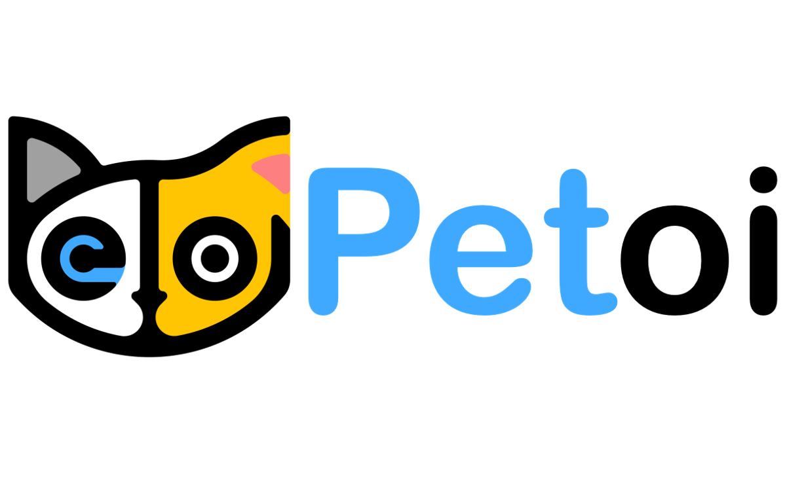

# Библиотека расширений Petoi Mind+ 
### Инструмент программирования с использованием блоков для роботов Petoi.


---------------------------------------------------------

## Содержание
- [Библиотека расширений Petoi Mind+](#библиотека-расширений-petoi-mind)
  - [Содержание](#содержание)
  - [URL](#url)
  - [Краткое описание](#краткое-описание)
  - [Как использовать](#как-использовать)
  - [Примеры](#примеры)
  - [Лицензия](#лицензия)
  - [Поддерживаемые цели](#поддерживаемые-цели)
  - [История версий](#история-версий)

## URL
* URL оригинального проекта: ```https://github.com/PetoiCamp/Petoi_MindPlusLib```
* URL русского проекта: ```https://github.com/DSvinka/Petoi_MindPlusLib_RU```

## Краткое описание
Используйте библиотеку Mind+ версии V1.7.3 и выше для загрузки этого расширения и управления роботом Petoi.
Библиотека позволяет планировать движения, воспроизводить музыку и получать доступ к контактам GPIO.

## Как использовать
Скачайте и установите [Mind+ Desktop app](https://mindplus.dfrobot.com).

Введите URL проекта: **https://github.com/DSvinka/Petoi_MindPlusLib_RU** в интерфейс, чтобы импортировать эту библиотеку, как показано ниже:


Для macOS, если ваша версия Mind+ <=V1.7.2 RC3.0, сначала скачайте [PetoiRobot.zip](https://github.com/DSvinka/Petoi_MindPlusLib_RU/raw/main/PetoiRobot.zip) и скопируйте извлечённую папку (**PetoiRobot**) в **/Users/{ваше имя пользователя}/Documents/mindplus-py/environment/Python3.6.5-64/lib/python3.6/site-packages/**.

* Перед запуском программы мы рекомендуем [обновить прошивку робота до последней версии](https://bittle.petoi.com/3-NyBoard-Configuration) для лучшей совместимости. Стандартная прошивка поддерживает большинство блоков программирования. Однако для доступа к контактам IO нужно использовать режим **GROVE_SERIAL_PASS_THROUGH**.
 


## Примеры
Следующие примеры можно найти в папке [examples/](https://github.com/JasonWong08/ext-petoi_robot/tree/main/examples) и открыть напрямую в приложении Mind+.

Воспроизведение мелодии (/examples/PlayMelody.mp)


Выполнение навыков (/examples/ExecuteSkills.mp)


Поворот (/examples/TurnAround.mp)


Запись значения на цифровой пин (/examples/WriteDigital.mp)


Запись значения на аналоговый пин (/examples/WriteAnalog.mp)


Чтение случайных значений аналогового пина и их преобразование в музыкальные тоны (/examples/ReadAnalog.mp)


Управление суставами робота и воспроизведение мелодии (/examples/Robot.mp)


## Лицензия
MIT

## Поддерживаемые цели

MCU                | JavaScript    | Arduino   | MicroPython    | Python
---------------- | :------------: | :---------: | :---------------: | ----------
arduino            |                     |                 |                          |       √
esp32               |                     |                 |                          |       √

## История версий
* V0.0.1  Основные функции завершены.

## Ссылка на зарубежный [интернет-магазин](https://www.petoi.com/collections/robots) для покупки аппаратного обеспечения роботов.